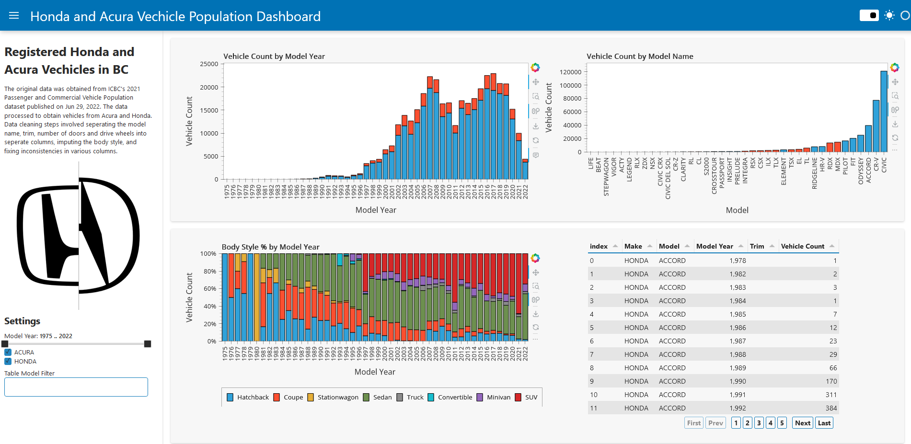

#  python dashboard with Panel
### Interactive Visualization of Registered Honda and Acura Vechicles in BC

The original data was obtained from ICBC's 2021 Passenger and Commercial Vehicle Population dataset published on Jun 29, 2022. The data processed to obtain vehicles from Acura and Honda. Data cleaning steps involved seperating the model name, trim, number of doors and drive wheels into seperate columns, imputing the body style, and fixing inconsistencies in various columns.

To serve the dashboard locally, use the command:
```
panel serve dashboard.ipynb
```

